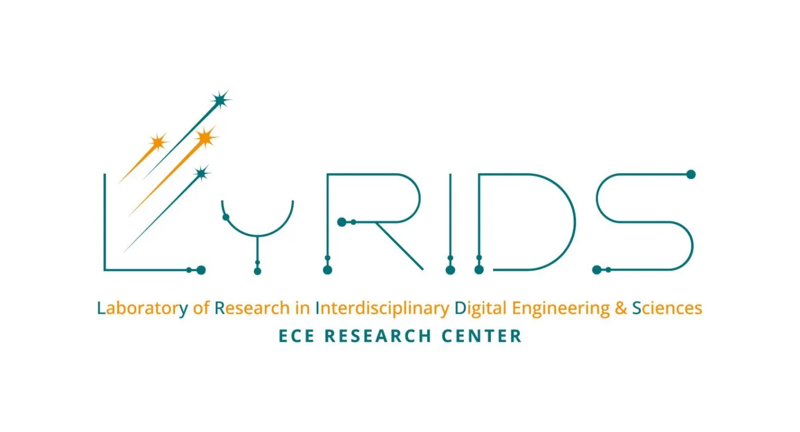

# 🏷️ LyRIDS – OWNER Implementation


<p align="center">
  
</p>

---

## 📝 Project Description

This project is an implementation of **OWNER** (Toward Unsupervised Open-World Named Entity Recognition), a pipeline that performs **Named Entity Recognition** (NER) in two stages: **Mention Detection** (position-based) and **Entity Typing** (type assignment via prompt-based encoding). The system uses **DistilBERT** for mention detection and **BERT** with [MASK] token prompts for entity embeddings, which are then clustered via **K-means** to assign types.

This is a learning project where I rebuild and refine the OWNER pipeline from scratch, starting from the CoNLL-2003 dataset.

---

## ⚙️ Features

  🔍 **Two-stage NER pipeline**: Mention Detection → Entity Typing

  🧠 **Prompt-based entity encoding**: Uses [MASK] token embeddings from BERT for entity representation

  📊 **Automatic type clustering**: K-means with BIC-based k selection (no hardcoded type count)

  📈 **Contrastive learning**: Triplet Margin Loss to refine entity embeddings by type

  ⚡ **GPU-optimized**: Uses CUDA 12.1 with PyTorch for efficient training

  🎯 **End-to-end evaluation**: AMI and ARI metrics to compare predicted vs. ground-truth entity types

---

## ⚙️ How it works

  🎯 **Mention Detection (MD)**: Uses a **DistilBERT** encoder with BIO sequence tagging to detect entity mention boundaries in sentences.

  🏷️ **Entity Typing (ET)**: For each detected entity, constructs a prompt like `"{entity} is a [MASK]. Context: {sentence}"`, encodes it with **BERT**, and extracts the [MASK] token embedding as the entity representation.

  🧬 **Contrastive refinement**: Trains embeddings with **Triplet Margin Loss** in batch mode — valid triplets (same type positive, different type negative) push embeddings of the same type closer together.

  🎲 **Automatic clustering**: After training, uses **K-means** with a configurable range (e.g., k ∈ [2, 30]) and selects k via **BIC** (Bayesian Information Criterion) — no hardcoded type count needed.

  📊 **End-to-end evaluation**: MD predicts entity positions, ET assigns cluster IDs as types, and metrics (AMI, ARI) measure agreement with ground truth.

---

## 📂 Repository structure

```bash
LyRIDS_OWNER/
├── src/
│   ├── data/
│   │   ├── datasets/
│   │   │   ├── entity_typing.py      # PyTorch Dataset for ET
│   │   │   └── mention_detection.py  # PyTorch Dataset for MD
│   │   ├── preprocessing/
│   │   │   └── huggingface.py        # CoNLL-2003 → OWNER format
│   │   ├── schema.py                 # Data classes (Document, Entity, etc.)
│   │   └── serialization.py          # Load/save OWNER JSON datasets
│   │
│   ├── models/
│   │   ├── entity_typing.py          # EntityEncodingModel + AutoKmeans
│   │   └── mention_detection.py      # MentionDetectionModel (BIO tagging)
│   │
│   ├── training/
│   │   ├── base.py                   # BaseTrainer interface
│   │   ├── entity_typing.py          # EntityTypingTrainer + BatchTripletMarginLoss
│   │   ├── mention_detection.py      # MentionDetectionTrainer
│   │   └── ner.py                    # NerTrainer (end-to-end orchestration)
│   │
│   └── evaluation/
│       ├── base.py                   # Entity alignment & merging utilities
│       └── entity_typing.py          # AMI / ARI computation
│
├── tests/
│   └── test_ner_training.py          # Full pipeline: train MD → ET → evaluate → save
│
├── data/
│   ├── 1-raw/                        # Raw datasets (CoNLL-2003)
│   │   ├── .gitkeep
│   │   └── conll2003_noMISC.py       # HF → OWNER preprocessing script
│   │
│   ├── 2-processed/                  # OWNER format (train/test splits)
│   │   └── .gitkeep
│   │
│   └── 3-external/                   # Reference data if needed
│       └── .gitkeep
│
├── outputs/
│   ├── models/                       # Trained model checkpoints
│   ├── logs/                         # Training logs (MLflow, future)
│   └── results/                      # Evaluation metrics
│
├── assets/
│   └── logo.webp                     # Project logo for README
│
├── .gitignore
├── LICENSE
└── README.md
```

---

## 💻 Run it on Your PC

### Prerequisites

Clone the repository and prepare your environment:

```bash
git clone https://github.com/Thibault-GAREL/LyRIDS_OWNER.git
cd LyRIDS_OWNER

python -m venv .venv  # if you don't have a virtual environment
source .venv/bin/activate   # Linux / macOS
.venv\Scripts\activate      # Windows
```

### Install dependencies

```bash
pip install torch==2.5.1+cu121 transformers==4.36.2 scikit-learn pandas torch-linalg tqdm
```

⚠️ You need a **CUDA-compatible GPU** (~6 GB VRAM minimum, tested on GTX 1660 Ti Max-Q).

### Download and preprocess data

```bash
# Download CoNLL-2003 (no MISC tag) and convert to OWNER format
cd data/1-raw
python conll2003_noMISC.py
cd ../..
```

### Train the full NER pipeline

```bash
python -m tests.test_ner_training
```

This will:
1. Train **Mention Detection** on the training set (2 epochs, ~30 min on GTX 1660 Ti)
2. Train **Entity Typing** with Triplet Loss (2 epochs, ~15 min)
3. Evaluate end-to-end on the test set (print AMI, ARI, entity counts)
4. Save both models to `outputs/models/ner_checkpoint/`

---

⚠️ **Status**: This project is **work in progress**. Phase 5A (basic training + saving) is complete. Phases 5C–5E (MLflow, config centralization, polish) are in progress.

---

## 📖 Inspiration / Sources

This project is based on:

- 📄 [OWNER: Toward Unsupervised Open-World Named Entity Recognition](https://peportier.me/publications/2025_GENEST_OWNER__Toward_Unsupervised_Open-World_Named_Entity_Recognition.pdf) — The original paper describing the OWNER pipeline.
- 🔗 [OWNER Original Repository](https://github.com/alteca/OWNER) — Reference implementation by the authors.

Code created by me 😎, Thibault GAREL - [Github](https://github.com/Thibault-GAREL)
